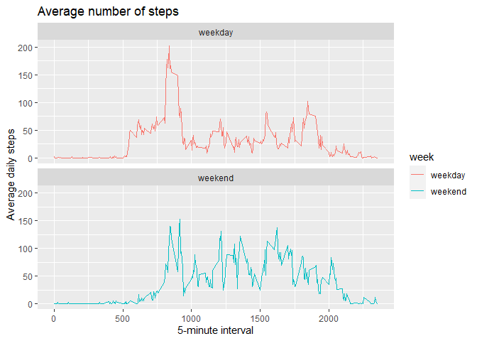

## Loading and preprocessing the data


```r
library(dplyr)
library(ggplot2)
unzip('activity.zip')
data<-read.csv('activity.csv')
```

## What is mean total number of steps taken per day?

1.  The total number of steps taken per day


```r
df <- data %>% group_by(date) %>% summarise(total_steps=sum(steps))
head(df)
```

```
## # A tibble: 6 x 2
##   date       total_steps
##   <chr>            <int>
## 1 2012-10-01          NA
## 2 2012-10-02         126
## 3 2012-10-03       11352
## 4 2012-10-04       12116
## 5 2012-10-05       13294
## 6 2012-10-06       15420
```

2.  A histogram of the total number of steps taken each day


```r
hist(df$total_steps, breaks = 50, main="Daily total steps", xlab="Steps")
```

<!-- -->

3.  The mean and median of the total number of steps taken per day


```r
mean_steps = mean(df$total_steps, na.rm=TRUE)
median_steps = median(df$total_steps, na.rm=TRUE)
```
The mean of of the total number of steps taken per day is 1.0766189\times 10^{4} and median is 10765.

## What is the average daily activity pattern?

1.  A time series plot (i.e. type = "l") of the 5-minute interval (x-axis) and the average number of steps taken, averaged across all days (y-axis)


```r
df2 <- data %>% group_by(interval) %>% summarise(avg_steps=mean(steps, na.rm=TRUE))
plot(x=df2$interval,y=df2$avg_steps, type="l", main="Average daily steps", xlab="5-minute interval", ylab = "Average number of steps")
```

<!-- -->

2.  A 5-minute interval which on average across all the days in the dataset, contains the maximum number of steps?


```r
max_steps_interval<- df2[df2$avg_steps==max(df2$avg_steps),1]
```
It is: 835.

## Imputing missing values

1.  The total number of missing values in the dataset (i.e. the total number of rows with NAs).


```r
missing=sum(is.na(data))
```
The total number of missing values is 2304.

2.  Filling in all of the missing values in the dataset with the median of the dataset.


```r
data[is.na(data[,1]),1]<-median(data[,1], na.rm=TRUE)
head(data)
```

```
##   steps       date interval
## 1     0 2012-10-01        0
## 2     0 2012-10-01        5
## 3     0 2012-10-01       10
## 4     0 2012-10-01       15
## 5     0 2012-10-01       20
## 6     0 2012-10-01       25
```

3.  A new dataset that is equal to the original dataset but with the missing data filled in.


```r
write.csv(data, "activity_no_na.csv")
```

4. A histogram of the total number of steps taken each day.


```r
df3 <- data %>% group_by(date) %>% summarise(total_steps=sum(steps))
hist(df3$total_steps, breaks = 50, main="Daily total steps", xlab="Steps")
```

<!-- -->

5. The mean and median total number of steps taken per day.

```r
mean_steps1 = mean(df3$total_steps, na.rm=TRUE)
median_steps1 = median(df3$total_steps, na.rm=TRUE)
```
The mean of of the total number of steps taken per day is 9354.2295082 and median is 1.0395\times 10^{4}.

6. The difference and the impact of imputing missing data on the estimates of the total daily number of steps.

|     | With NA values | NA filled     |
|:----------- | :----------: | -----------:|
| Mean | 1.0766189\times 10^{4} |9354.2295082   |   
| Median | 10765 |1.0395\times 10^{4} |        

## Are there differences in activity patterns between weekdays and weekends?

1. A new factor variable in the dataset with two levels – “weekday” and “weekend” indicating whether a given date is a weekday or weekend day.

```r
data<-transform(data,date=as.POSIXct(as.character(date),"%Y%m%d"))
weekend<-c("Saturday","Sunday")
data<-mutate(data,week=factor(weekdays(data$date)%in%weekend,labels=c("weekday","weekend")))
head(data)
```

```
##   steps       date interval    week
## 1     0 2012-10-01        0 weekday
## 2     0 2012-10-01        5 weekday
## 3     0 2012-10-01       10 weekday
## 4     0 2012-10-01       15 weekday
## 5     0 2012-10-01       20 weekday
## 6     0 2012-10-01       25 weekday
```

2. A panel plot containing a time series plot (i.e. type = "l") of the 5-minute interval (x-axis) and the average number of steps taken, averaged across all weekday days or weekend days (y-axis). 

```r
df4 <- data %>% group_by(interval,week) %>% summarise(avg_steps=mean(steps, na.rm=TRUE))
ggplot(df4, aes(interval, avg_steps, col = week)) + geom_line()+labs(title = "Average number of steps", x = "5-minute interval", y = "Average daily steps") + facet_wrap(~`week` , ncol = 1, nrow=2)
```

<!-- -->
